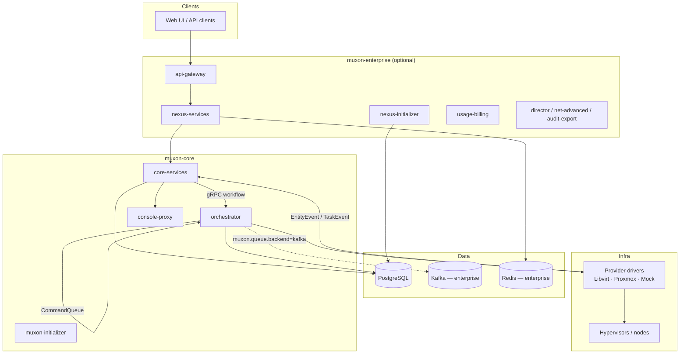

# Muxon Platform Architecture

Muxon is a multi-tenant private-cloud control plane split into two Gradle repositories:

| Repository | Role |
|---|---|
| **muxon-core** | Open foundation: REST API, orchestration, state store, provider drivers, OSS queue |
| **muxon-enterprise** | Nexus edition: wraps core as a library, adds enterprise services, Kafka queues, extended RBAC |

Enterprise does **not** fork the core API. `nexus-services` depends on published `core-services` artifacts and reuses the same controllers, services, and persistence layer via Spring component scanning.

## High-Level Topology

## Module Boundaries

### muxon-core

| Layer | Modules | Responsibility |
|---|---|---|
| **API contracts** | `libs/core-api`, `libs/core-proto` | OpenAPI DTOs; gRPC workflow definitions |
| **Shared libraries** | `libs/core-auth`, `libs/core-commons`, `libs/core-customization`, `libs/core-initializer` | Permissions, roles, encryption, guest customization, bootstrap |
| **Persistence** | `libs/core-persistence` | JPA entities, repositories, Flyway OSS migrations, DB queue adapters |
| **Provider SPI** | `libs/core-provider` | `VmProvider`, storage SPIs, queue port interfaces |
| **Worker runtime** | `libs/core-worker` | Task executors, provider registry wiring |
| **Auth contract** | `services/auth-api` | `AuthorizationService` interface, `@RequiresPermission` |
| **Runtime services** | `services/core-services` | REST API, security, entity CRUD, entity-event consumer |
| | `services/orchestrator` | gRPC workflow server, job lifecycle, worker poller, task-event consumer |
| | `services/console-proxy` | WebSocket bridge to VM consoles |
| | `services/muxon-initializer` | First-boot Flyway + Keycloak/OIDC bootstrap |
| **Provider plugins** | `providers/libvirt`, `providers/proxmox`, `providers/mock` | Concrete hypervisor implementations |

**Strict table ownership** (enforced by design, not DB constraints):

| Owner | Tables |
|---|---|
| `core-services` | `vm`, `content_*`, `providers`, `nodes`, `datacenters`, `tenants`, `tenant_datacenter_grants`, `identity_*`, `system_*`, `role_bindings`, storage tables, `entity_events` |
| `orchestrator` | `jobs`, `task_steps`, `task_logs` |
| Shared queue | `orchestrator_queue` (partitioned by `queue_category`) |

The worker has **read-only** access to entity tables and **never** writes job rows directly.

### muxon-enterprise

| Layer | Modules | Responsibility |
|---|---|---|
| **Enterprise libs** | `nexus-api`, `nexus-auth`, `nexus-persistence`, `nexus-rbac`, `nexus-billing`, `nexus-branding` | Enterprise OpenAPI, project permissions, extra Flyway scripts, billing/branding hooks |
| **Queue override** | `nexus-queue-kafka`, `nexus-queue-kafka-autoconfig` | Kafka implementations of core queue SPIs |
| **Services** | `nexus-services` | Primary API process (core + enterprise beans) |
| | `nexus-initializer` | Enterprise bootstrap (OSS + enterprise Flyway, config generation) |
| | `api-gateway` | Reactive edge gateway (JWT validation, CORS) |
| | `usage-billing`, `director`, `net-advanced`, `audit-export` | Satellite enterprise capabilities |
| **UI** | `ui/themes` | Enterprise theming assets |

Enterprise resolves core via Gradle `includeBuild("../muxon-core")` when a local checkout exists, otherwise from Maven (`com.scal.muxon:*:0.1.0`).

## Shared Abstractions

Cross-cutting contracts live in **core libraries** so both editions share the same semantics:

| Abstraction | Package | Purpose |
|---|---|---|
| `VmProvider` | `com.scal.muxon.providers` | Async VM lifecycle against a hypervisor |
| `ProviderContext` | same | Provider-scoped connection/placement context |
| `StorageProvider` / `StorageDiscoveryProvider` | `providers.storage` | Block/object storage operations and discovery |
| `CommandQueue` | `com.scal.muxon.spi.queue` | Orchestrator → worker command transport |
| `TaskEventQueue` | same | Worker → orchestrator job progress |
| `EntityEventQueue` | same | Worker → core-services entity state updates |
| `EventPublisher` | same | Legacy event sink (superseded by typed queues) |
| `AuthorizationService` | `com.scal.muxon.auth` | Permission checks decoupled from transport |
| `Permission` / `RoleRegistry` | `com.scal.muxon.auth` | Built-in permission catalog and role templates |
| `CapabilityProvider` / `ModuleProvider` | `com.scal.muxon.info` | Product capability advertisement (`/api/v1/info`) |

## Extension Points

| Mechanism | How to extend |
|---|---|
| **Provider drivers** | Implement `VmProvider` (+ optional `ProviderContext`); register in `TenantAwareVmProviderRegistry` switch on `ProviderType` |
| **Queue backend** | Provide `@Bean` implementations of `CommandQueue`, `TaskEventQueue`, `EntityEventQueue` with `@ConditionalOnMissingBean` winning over `QueueDbConfiguration` |
| **Enterprise Kafka** | Set `muxon.queue.backend=kafka`; `NexusQueueKafkaAutoConfiguration` registers Kafka beans before DB auto-config |
| **Authorization** | Implement `AuthorizationService`; mark `@Primary` in enterprise to override OSS Caffeine-based impl |
| **Capabilities** | Add a `@Component` implementing `CapabilityProvider`; `CapabilityRegistry` aggregates all providers |
| **REST controllers** | Enterprise adds controllers under `com.scal.muxon.ent.controllers` implementing OpenAPI interfaces from `nexus-api` |
| **Flyway** | OSS scripts in `classpath:db/migration/oss`; enterprise adds `classpath:db/migration/enterprise` |
| **Spring listeners** | `META-INF/spring.factories` registers `ConfigDecryptor` before datasource creation (encrypted passwords) |

## Deployment Modes

| Mode | Processes | Queue |
|---|---|---|
| **Core OSS** | `core-services`, `orchestrator`, `console-proxy` | PostgreSQL `orchestrator_queue` |
| **Nexus Enterprise** | `nexus-services` (replaces `core-services`), `orchestrator`, `api-gateway`, satellites | Kafka (optional) or DB |

Key property flags:

- `muxon.enterprise.enabled=true` — disables OSS `UnifiedTaskPoller` (enterprise worker scaling path)
- `muxon.queue.backend=kafka` — activates Kafka queue auto-configuration

## Design Principles

1. **Intent vs. execution** — API layer records desired state; workers mutate infrastructure and report facts via events.
2. **No provider calls from core-services** — VM workflows go through gRPC to the orchestrator.
3. **Swappable transport** — Queue SPI lets enterprise replace DB polling with Kafka without changing business logic.
4. **Single API surface** — Nexus scans core packages; enterprise features are additive controllers and `@Primary` beans.
5. **HATEOAS action links** — `ActionLinkService` uses `AuthorizationService` to emit permitted next actions per resource.

## Related Documents

- [Core System](./core-system.md) — OSS modules and services in detail
- [Enterprise System](./enterprise-system.md) — Nexus overrides and satellite services
- [Data Flow](./data-flow.md) — Request-to-hypervisor lifecycle and event paths
