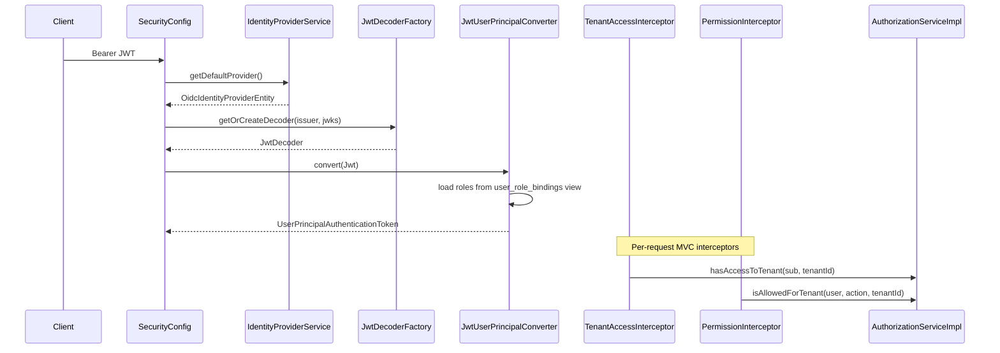

# Muxon Core System

muxon-core (`com.scal.muxon:0.1.0`) is the open control-plane foundation. All modules are declared in `settings.gradle.kts`.

## Module Map

```
muxon-core/
├── libs/
│   ├── core-api          # OpenAPI-generated models and API interfaces
│   ├── core-proto        # gRPC workflow service definitions
│   ├── core-auth         # Permission enum, RoleRegistry, HATEOAS action descriptors
│   ├── core-commons      # Encryption, UUID utils, ConfigDecryptor, OIDC helpers
│   ├── core-customization# Guest customization renderers, seed ISO builder
│   ├── core-initializer  # BootstrapConfig, CoreInitializerService, Flyway OSS
│   ├── core-persistence  # JPA entities/repos, Flyway OSS migrations, Db*Queue adapters
│   ├── core-provider     # VmProvider SPI, queue port interfaces, ProviderPlugin
│   └── core-worker       # VmTaskExecutor, TaskRouter, TenantAwareVmProviderRegistry
├── services/
│   ├── auth-api          # AuthorizationService interface, @RequiresPermission annotations
│   ├── core-services     # Main REST API (Spring Boot)
│   ├── orchestrator      # gRPC workflow + worker poller + job processor
│   ├── console-proxy     # noVNC/WebSocket console bridge
│   └── muxon-initializer # First-boot installer job
├── providers/
│   ├── libvirt           # LibvirtVmProvider
│   ├── proxmox           # ProxmoxVmProvider, node inventory
│   └── mock              # MockVmProvider (dev/test)
└── integration-tests
```

## Runtime Services

### core-services

Entry point: `CoreServicesApplication`

Scans: `config`, `security`, `controllers`, `services`, `events`, `grpc`, `info`, `hateoas`, `auth`, `web`, `db.resolver`

Responsibilities:

- REST API under `/api/v1/**` (OpenAPI-driven controllers)
- OIDC JWT resource-server security
- Tenant membership and permission interceptors
- Entity CRUD and projections (VMs, tenants, providers, content libraries, storage)
- gRPC **client** to orchestrator for async workflows
- `EntityEventProcessor` — sole writer of entity state in response to worker events
- Direct `CommandQueue` usage for synchronous-adjacent flows (e.g. console resolve polling)

Dependencies: all core libs + `auth-api` + gRPC client stack.

### orchestrator

Entry point: `OrchestratorApp` — scans entire `com.scal.muxon` tree.

Responsibilities:

- gRPC **server**: `VmWorkflowGrpcService`, `ContentLibraryWorkflowGrpcService`, `JobQueryGrpcService`
- `JobService` — creates `jobs` rows, enqueues `COMMAND` messages
- `TaskEventProcessor` — consumes worker task events, updates job status
- `UnifiedTaskPoller` — polls `CommandQueue`, routes to `TaskRouter` → executors
- Embeds `core-worker` and all provider modules

The orchestrator and core-services can run as separate JVMs sharing PostgreSQL, or be co-located in development.

### console-proxy

Standalone Netty/Spring service bridging browser WebSocket sessions to hypervisor VNC/SPICE endpoints using tokens from `console_sessions`.

### muxon-initializer

One-shot bootstrap:

1. Run Flyway OSS migrations (`classpath:db/migration/oss`)
2. Configure OIDC identity provider from `initial-config.yaml`
3. Seed system tenant, admin role bindings, system settings
4. Generate encrypted `application.yaml` for core-services, orchestrator, console-proxy

## Provider Layer

### VmProvider contract

```java
// libs/core-provider — com.scal.muxon.providers.VmProvider
CompletableFuture<VmCreationResult> createVm(VmCreationRequest request);
CompletableFuture<VmDeletionResult> deleteVm(VmDeletionRequest request);
// start/stop/restart/suspend/resume, getVmInfo, listVms, getCapabilities, validateVmSpec
// attachIso, detachIso, cloneVmAsTemplate, getConsoleConnection (default)
// queryGuestAgent, detachCustomizationSeed (defaults)
```

Implementations:

| Provider | Module | Backend |
|---|---|---|
| `LibvirtVmProvider` | `providers/libvirt` | libvirt/KVM |
| `ProxmoxVmProvider` | `providers/proxmox` | Proxmox VE API |
| `MockVmProvider` | `providers/mock` | In-memory stub |

### Provider resolution

`TenantAwareVmProviderRegistry` (in `core-worker`):

1. Resolve `provider_id` from `tenant_datacenter_grant_id` via `TransactionalGrantProviderResolver`
2. Load `ProviderEntity` from DB
3. Instantiate provider by `ProviderType` enum (`LIBVIRT`, `PROXMOX`)
4. Build type-specific `ProviderContext` (node selection, storage pool, Proxmox import source)

Providers are cached per provider UUID (5-minute TTL).

### Storage SPI

- `StorageProvider` — block/object CRUD against a backend
- `StorageDiscoveryProvider` — sync provider storage inventory into `provider_storage`

Storage class scheduling uses capability matching (`storage_classes.capabilities` vs `provider_storage.capabilities`) with optional manual `storage_overrides`.

## Queue System (OSS)

Port interfaces in `libs/core-provider`:

| Interface | Direction | Producer | Consumer |
|---|---|---|---|
| `CommandQueue` | Orchestrator → Worker | `JobService`, `VmsService` (console) | `UnifiedTaskPoller` |
| `TaskEventQueue` | Worker → Orchestrator | `VmTaskExecutor` | `TaskEventProcessor` |
| `EntityEventQueue` | Worker → Core-services | `VmTaskExecutor` | `EntityEventProcessor` |
| `EventPublisher` | Legacy | various | deprecated path |

OSS implementation: `QueueDbConfiguration` registers `DbCommandQueue`, `DbTaskEventQueue`, `DbEntityEventQueue` backed by `orchestrator_queue` with `queue_category` discriminator (`COMMAND`, `TASK_EVENT`, `ENTITY_EVENT`, etc.).

Each bean uses `@ConditionalOnMissingBean` so enterprise can replace any queue without modifying core code.

## Authentication & Authorization

### Auth flow (core-services)



**JWT validation** — `SecurityConfig` uses an `AuthenticationManagerResolver` that loads the default OIDC provider from `identity_providers`, builds/caches a `JwtDecoder` per provider row, and converts claims to `UserPrincipal` via `JwtUserPrincipalConverter`.

**Role resolution** — Roles come from `role_bindings` joined to `idp_users` through the `user_role_bindings` view. The JWT `sub` claim maps to `idp_users.external_id`.

**Tenant guard** — `TenantAccessInterceptor` blocks `/api/v1/tenants/{tenantId}/**` sub-resources when the caller lacks membership (via role binding scope).

**Permission guard** — Controllers annotate methods with `@RequiresPermission(Permission.VM_CREATE)` (from `auth-api`). `PermissionInterceptor` resolves the action, extracts tenant ID from the path, and calls `AuthorizationService`.

### Built-in RBAC

| Component | Location | Role |
|---|---|---|
| `Permission` enum | `libs/core-auth` | Canonical action strings (`vm:create`, `tenant:manage`, …) with `Scope` (SYSTEM, TENANT, TENANT_GLOBAL) |
| `RoleRegistry` | `libs/core-auth` | Built-in roles: `system:admin`, `tenant:admin`, `workload:operator`, `workload:user` |
| `role_bindings` table | Flyway OSS | Binds subjects (USER/GROUP/SERVICE_ACCOUNT) to role names at a scope |
| `AuthorizationServiceImpl` | `core-services` | Caffeine-cached permission resolution from role bindings + `RoleRegistry` |

Enterprise custom roles are **not** in core; see [Enterprise System](./enterprise-system.md).

## Identity Providers

Stored in `identity_providers` (protocol: OIDC/OAUTH2, metadata JSONB). One system provider allowed (`is_system = true`). Users mirrored in `idp_users`.

Core bootstrap (`CoreInitializerService`) registers the OIDC provider from `initial-config.yaml` and links the admin user's external ID to `system:admin`.

## Product Info / Capabilities

`InfoService` aggregates:

- `CoreCapabilityProvider` — base capabilities (`monitoring.metrics`) and configurable modules via `muxon.modules`
- `LicenseCapabilityProvider` — license-gated features
- Any additional `CapabilityProvider` beans on the classpath (enterprise adds its own)

`RoleRegistry.getCapabilitiesForRoles()` maps permission actions to UI capability buckets (`vm.create`, `storage.view`, etc.).

## Guest Customization

`libs/core-customization` provides:

- OS-specific renderers (cloud-init, sysprep, etc.)
- `SeedIsoBuilder` — builds customization seed ISO
- Worker integration in `VmTaskExecutor` — attaches seed, polls guest agent, emits customization entity events

VM columns: `customization`, `customization_status`, `customization_seed_path` (migration `V202604150708`).

## gRPC Workflow Boundary

core-services **never** calls providers directly for VM operations. Pattern:

1. Persist entity in desired state (e.g. VM `PENDING`)
2. Build gRPC request (`CreateVMRequest`, etc.)
3. Call orchestrator stub → receive `JobResponse` with `jobId`
4. Return job reference to client; poll job or entity status

Console resolve is an exception: core-services enqueues a `CommandQueue` message directly and polls for completion payload.

## Configuration & Secrets

- `ConfigDecryptor` (`spring.factories`) decrypts `spring.datasource.password` before datasource init
- Instance encryption key derived in initializer: `SHA-256(instanceName + instanceId + passphrase)`
- Used for field-level encryption (e.g. VM customization secrets)

## Build & Publish

- Group: `com.scal.muxon`, version `0.1.0`
- Java 25
- `core-services` published as a library JAR consumed by `nexus-services`
- Maven repository: GitHub Packages (`scal/muxon-core`)
