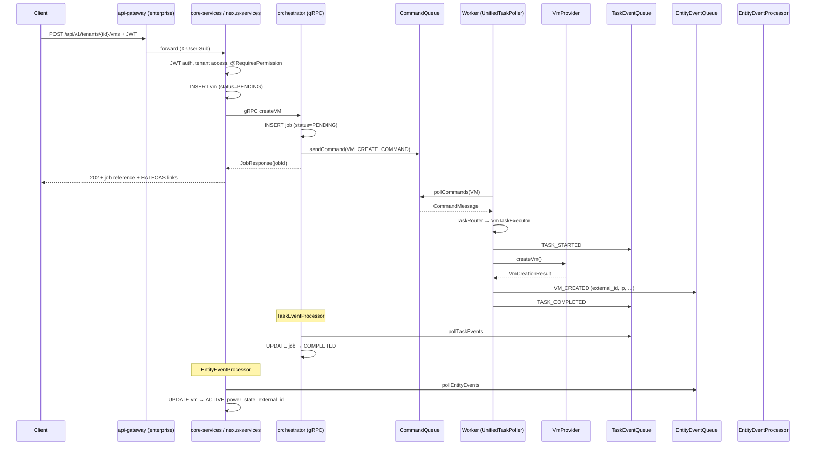
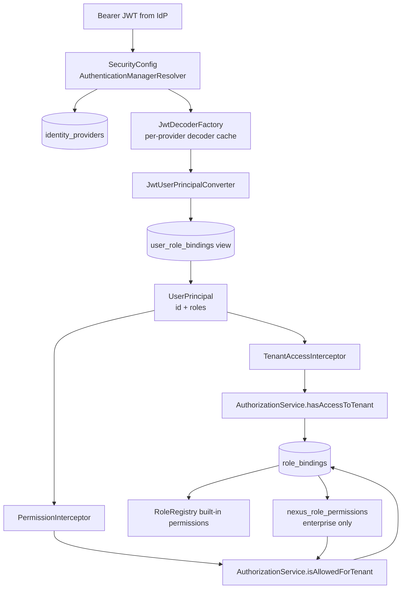
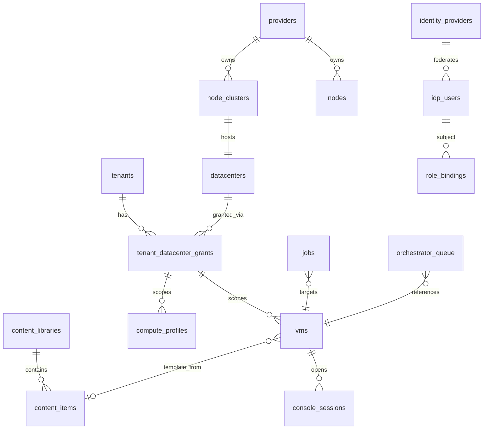

# Muxon Data Flow

This document traces how requests, commands, events, and state updates move through muxon-core and muxon-enterprise.

## End-to-End Request Flow



## Planes of Data

| Plane | Components | Data owned |
|---|---|---|
| **API / control** | core-services, nexus-services | Desired entity state, RBAC, IdP config, audit |
| **Orchestration** | orchestrator | Job lifecycle, command enqueue |
| **Execution** | core-worker (in orchestrator JVM) | Provider calls, event emission (no entity writes) |
| **Infrastructure** | provider drivers | Runtime VM/node facts on hypervisors |

## Authentication Data Flow



### IdP configuration path

1. Admin configures OIDC provider → row in `identity_providers` (issuer, jwks URI in `metadata` JSONB)
2. User authenticates against IdP (e.g. Keycloak realm `muxon-dev`, audience `muxon-api`)
3. API validates JWT signature/issuer via cached `JwtDecoder`
4. `sub` claim matched to `idp_users.external_id`
5. Roles loaded from `role_bindings` where `subject_id = idp_users.id`

### Tenant-scoped vs system-scoped checks

| Path pattern | Tenant extraction | Permission scope |
|---|---|---|
| `/api/v1/tenants` | none | SYSTEM roles |
| `/api/v1/tenants/{id}` (exact) | none (tenant CRUD) | SYSTEM roles |
| `/api/v1/tenants/{id}/vms/...` | `{id}` | TENANT + TENANT_GLOBAL + SYSTEM bindings |

## Orchestration Queues

All async handoffs use the queue SPI. OSS persists to `orchestrator_queue`; enterprise may use Kafka topics with identical message shapes.

### Queue categories

| Category | Enum value | Purpose |
|---|---|---|
| Command | `COMMAND` | Work units for workers |
| Task event | `TASK_EVENT` | Job progress feedback |
| Entity event | `ENTITY_EVENT` | Entity state mutations for core-services |
| Status / Audit | `STATUS`, `AUDIT` | Reserved / ancillary |

### Command lifecycle (DB backend)

1. `sendCommand` → INSERT `orchestrator_queue` (`status=PENDING`, `queue_category=COMMAND`)
2. `pollCommands` → SELECT … FOR UPDATE SKIP LOCKED, set `status=PROCESSING`
3. Worker executes → `markCompleted` or `markFailed`
4. Stall recovery: `resetStalledEntries` returns stale `PROCESSING` rows to `PENDING`

### Task event types

Consumed by `TaskEventProcessor` → updates `jobs` table:

- `STARTED` → job `RUNNING`
- `COMPLETED` → job `COMPLETED`
- `FAILED` → job `FAILED` + error details
- Progress/heartbeat events update `progress_percentage`, `last_heartbeat_at`

### Entity event types (VM)

Consumed by `EntityEventProcessor` → `VmEntityEventHandler`:

| Event | Entity update |
|---|---|
| `VM_CREATED` | status → ACTIVE, set external_id, ip_addresses |
| `VM_CREATION_FAILED` | status → ERROR |
| `VM_POWER_ON/OFF/SUSPENDED` | power_state |
| `VM_DELETED` | status → DELETED |
| `VM_CUSTOMIZATION_*` | customization_status JSONB phases |

**Rule:** Only `EntityEventProcessor` transitions VM state machine fields in response to worker output. Workers read VM rows but do not `save()` status changes (except legacy console-resolve payload writes to queue entry).

## VM Create — Detailed Payload Flow

1. **API** (`VmsService.createVm`)
   - Validate grant, spec, permissions
   - INSERT `vms` (PENDING)
   - gRPC `CreateVMRequest` with spec JSON, ISO content IDs, grant ID, correlation ID

2. **Orchestrator** (`VmWorkflowGrpcService` → `JobService`)
   - INSERT `jobs` (VM_CREATE, PENDING)
   - Enrich payload with `jobId`
   - `CommandQueue.sendCommand` type `VM_CREATE_COMMAND`

3. **Worker** (`VmTaskExecutor`)
   - Resolve provider via grant → `TenantAwareVmProviderRegistry`
   - Optional: build customization seed ISO, attach ISOs from content library paths
   - `provider.createVm(request)` async
   - On success: `EntityEventQueue.publish(VM_CREATED, {externalId, ips, …})`
   - Always: `TaskEventQueue.publish(STARTED/COMPLETED/FAILED)`

4. **Orchestrator** (`TaskEventProcessor`) — job row terminal state

5. **API** (`EntityEventProcessor`) — VM row reflects runtime facts

## Content Library Flow

Parallel path via `ContentLibraryWorkflowGrpcService` and `ContentLibraryTaskExecutor`:

- Commands: `CONTENT_LIBRARY_SYNC`, `CONTENT_ITEM_FETCH`, `CONTENT_LIBRARY_REPLICATE`, etc.
- Entity events: `CL_DISTRIBUTION_ITEM_UPDATED`, `CL_DISTRIBUTION_COMPLETED`, `CL_DISTRIBUTION_FAILED`
- Handler: `ContentLibraryEntityEventHandler`

Distribution tracked in `content_library_distribution` and `content_item_distribution`.

## Console Session Flow

1. API validates `vm:console` permission
2. Enqueues `VM_CONSOLE_RESOLVE` command (not gRPC)
3. Worker calls `provider.getConsoleConnection()`
4. Worker writes result into command payload via `completeWithPayload`
5. API polls command status, creates `console_sessions` row with token
6. Browser connects to `console-proxy` with token → proxied to hypervisor WebSocket

## Database Structure

PostgreSQL is the single source of truth for control-plane state. Flyway manages schema versioning.

### OSS migrations (`db/migration/oss/`)

| Version | Domain | Key objects |
|---|---|---|
| V700 | Foundation | `providers`, `node_clusters`, `nodes`, `datacenters`, `tenants`, `tenant_datacenter_grants` |
| V701 | RBAC | `role_bindings`, enums `role_scope`, `subject_type` |
| V702 | Identity & audit | `identity_providers`, `idp_users`, `audit_logs`, `system_init`, `system_settings`, view `user_role_bindings` |
| V703 | Task framework | `orchestrator_queue`, `jobs`, `entity_events`, `task_steps`, `task_logs` |
| V704 | Storage | `storage_classes`, `provider_storage`, `volumes`, `snapshots`, `buckets`, views for usage/utilization |
| V705 | Content library | `content_storage`, `content_libraries`, `content_items`, distribution tables |
| V706 | Compute | `vms`, `compute_profiles` |
| V707 | Console | `console_sessions` |
| V708 | Customization | `vms.customization*` columns |

### Entity relationship (core)



### Key enums

- `provider_type`: PROXMOX, LIBVIRT
- `vm_status`: PENDING → PROVISIONING → ACTIVE / ERROR / DELETED / …
- `job_type`: VM_CREATE, VM_DELETE, VM_START, CONTENT_LIBRARY_SYNC, …
- `queue_category`: COMMAND, TASK_EVENT, ENTITY_EVENT, …

### Enterprise schema

Migrations in `db/migration/enterprise/`:

**V741 / V742 — Nexus RBAC**

```
nexus_permissions (action UNIQUE, scope role_scope)
nexus_roles (name UNIQUE, scope_type, scope_id, immutable)
nexus_role_permissions (role_id → nexus_roles, permission_id → nexus_permissions)
```

**Projects (entity-defined)**

`NexusProjectEntity` maps to `nexus_project`:

| Column | Type | Notes |
|---|---|---|
| id | UUID | PK |
| tenant_id | UUID FK | → tenants |
| tenant_datacenter_grant_id | UUID FK | optional placement scope |
| name, display_name, description | text | |
| status | project_status enum | |
| owner | UUID FK | → idp_users |
| resource_limits | JSONB | quotas |
| created_at, updated_at | timestamptz | |

> Note: JPA entity exists; verify Flyway DDL is present in your branch before relying on `nexus_project` in production.

## Enterprise Data Flow Differences

| Concern | OSS | Enterprise |
|---|---|---|
| Command transport | PostgreSQL poll | Kafka consumer groups (optional) |
| Tenant membership cache | Caffeine (in-process) | Redis with TTL |
| Custom permissions | Not supported | `nexus_permissions` + `nexus_role_permissions` |
| ABAC | Role-only | Optional OPA policy evaluation |
| API entry | Direct to core-services | Through api-gateway → nexus-services |
| Flyway locations | `oss` only | `oss` + `enterprise` |
| Worker poller | `UnifiedTaskPoller` in orchestrator | Disabled when `muxon.enterprise.enabled=true` |

## Bootstrap Data Flow

### Core initializer

```
initial-config.yaml
  → Flyway (oss)
  → INSERT identity_providers, idp_users, role_bindings
  → system_init.bootstrap_status = READY
  → encrypted application.yaml for core-services, orchestrator, console-proxy
```

### Nexus initializer

```
initial-config.yaml
  → Flyway (oss + enterprise)
  → generate nexus-services-application.yaml
  → same encryption key derivation as core
```

Placeholders: Flyway `${contentStorageDefaultPath}` → `/var/lib/muxon/content-libraries`.

## Audit & Events

- **Synchronous audit** — API services may write `audit_logs` (tenant_id, actor_user_id, action, payload)
- **Entity events table** — `entity_events` stores historical event log (parallel to queue-based entity events for some flows)
- **Enterprise audit-export** — intended for long-term export of audit streams (scaffold service)

## Consistency Model

- Commands are **at-least-once**; workers must be idempotent where possible
- Queue poll uses claim semantics to prevent duplicate processing within a worker pool
- Entity updates are **event-driven** and processed serially per event by `EntityEventProcessor`
- Optimistic locking on storage/content entities via JPA `@Version` columns
- Job state is authoritative in `jobs`; VM state is authoritative in `vms` after entity event application
