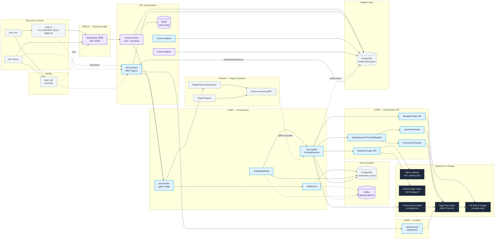
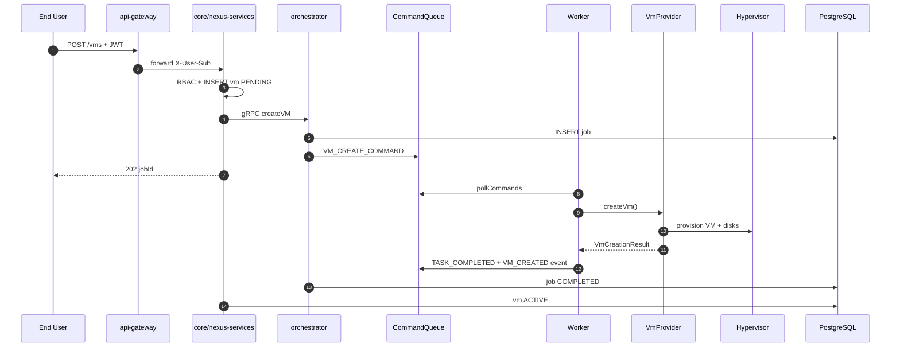

# Muxon System Architecture — End-to-End

High-level view from end user to VM storage on hypervisors. **Core (OSS)** uses sky blue `#0EA5E9`; **Enterprise (Nexus)** uses purple `#8B5CF6` (matches `muxon-web` themes).

## Eraser diagram (generated)

| Link | URL |
|------|-----|
| **Workspace** | https://app.eraser.io/workspace/Gr4Gy624K6NwJdSJbd6E |
| **Diagram (canvas)** | https://app.eraser.io/workspace/Gr4Gy624K6NwJdSJbd6E?diagram=YqxpV54zquN9Lkee93Fo&layout=canvas |
| **PNG export** | https://storage.googleapis.com/second-petal-295822.appspot.com/elements/autoDiagram%3Aed97777af0541e36345c2cbe19654dc0e6bf401a62ce2e6ee3d61abf250388df.png |

Open the workspace link to zoom, pan, and edit. Core components use blue; Nexus (enterprise) uses purple; physical data plane uses dark styling per the prompt in [eraser-architecture-prompt.md](./eraser-architecture-prompt.md).

## Architecture diagram (Mermaid)

## VM create sequence

## Component ownership

| Layer | Core (#0EA5E9) | Enterprise (#8B5CF6) | Shared |
|-------|-----------------|----------------------|--------|
| Edge | — | api-gateway | — |
| API | core-services | nexus-services (+ core JAR) | PostgreSQL |
| Orchestration | orchestrator, core-worker | Kafka queue override | — |
| Drivers | VmProvider, NetworkProvider, StorageProvider | — | Hypervisors |
| Plugins | registry, gRPC plugins (planned) | marketplace (future) | — |
| Authz | Caffeine + RoleRegistry | Redis + nexus_roles + OPA | OIDC IdP |
| Console | console-proxy | — | console_sessions |

## Storage path to VM

1. **API**: storage classes, provider_storage discovery, volume/snapshot entities in PostgreSQL.
2. **Scheduling**: `StorageSchedulerService` maps class → provider pool via capabilities.
3. **VM create**: worker attaches volumes / selects datastore via provider context.
4. **Runtime**: VM disks live on hypervisor storage pools (Ceph, ZFS, NFS, Proxmox datastore).
5. **Content**: ISO/templates distributed via content library → node path → attachIso at create.

## Related diagrams

- **[VM tenant workflow](./vm-tenant-workflow.md)** — KVM infra, catalog, Stack VM deploy, networking ([Eraser canvas](https://app.eraser.io/workspace/gKrqip06PHJSE70oGeXN?diagram=2F9vQBQoTewG-wuYiRca&layout=canvas))
- **[Kubernetes plugin tenant workflow](./kubernetes-plugin-tenant-workflow.md)** — K8s service deploy, mixed Stack (VM + pod), networking on KVM ([Eraser canvas](https://app.eraser.io/workspace/xzVYBSY5zG47WAy2z6OH?diagram=Fy0uEDgDGtNoAWTO3d3q&layout=canvas))

## Sources

- [architecture.md](./architecture.md)
- [data-flow.md](./data-flow.md)
- [core-system.md](./core-system.md)
- [enterprise-system.md](./enterprise-system.md)
- [system-map.md](system-map.md)
- `openspec/changes/plugin-extension-framework/design.md`
- `openspec/changes/networking-infrastructure/design.md`
