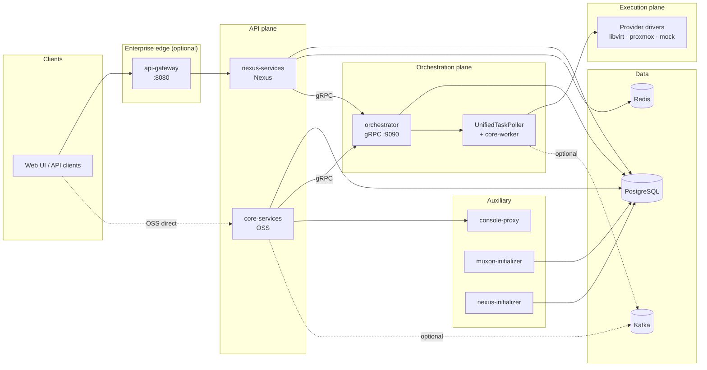
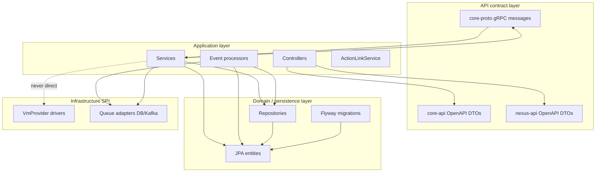
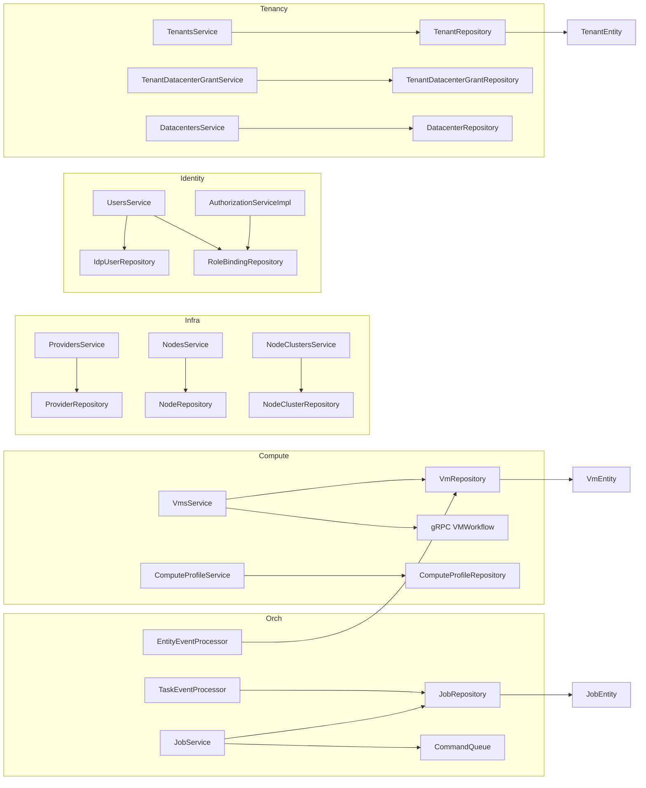

# Muxon System Dependency Map

Dependency map of **services**, **repositories**, **domain layers**, and **API boundaries** across `muxon-core` and `muxon-enterprise`.

> Derived from `architecture.md`, `core-system.md`, `enterprise-system.md`, `data-flow.md`, and the live codebase.

---

## 1. Repository & Module Dependency Graph

Two Gradle repositories compose the platform. Enterprise depends on core artifacts; it does not fork the REST API.

```mermaid
flowchart TB
    subgraph Enterprise["muxon-enterprise"]
        direction TB
        NA[nexus-api]
        NAuth[nexus-auth]
        NP[nexus-persistence]
        NR[nexus-rbac]
        NB[nexus-billing]
        NBr[nexus-branding]
        NK[nexus-queue-kafka]
        NKA[nexus-queue-kafka-autoconfig]

        GW[api-gateway]
        NS[nexus-services]
        NI[nexus-initializer]
        UB[usage-billing]
        DIR[director]
        NET[net-advanced]
        AE[audit-export]
    end

    subgraph Core["muxon-core"]
        direction TB
        CA[core-api]
        CP[core-proto]
        CAuth[core-auth]
        CC[core-commons]
        CCust[core-customization]
        CI[core-initializer]
        CPer[core-persistence]
        CProv[core-provider]
        CW[core-worker]
        AA[auth-api]

        CS[core-services]
        ORCH[orchestrator]
        CPX[console-proxy]
        INIT[muxon-initializer]

        LV[providers/libvirt]
        PX[providers/proxmox]
        MK[providers/mock]
    end

    NS --> CS
    NS --> CA
    NS --> CAuth
    NS --> CPer
    NS --> AA
    NS --> NA
    NS --> NAuth
    NS --> NP

    NI --> CI
    NI --> NP

    NKA --> NK
    NKA --> CProv
    NKA -.->|@Primary queue beans| ORCH

    CS --> CA
    CS --> CAuth
    CS --> CC
    CS --> CCust
    CS --> CPer
    CS --> CProv
    CS --> CP
    CS --> AA

    ORCH --> CW
    ORCH --> CPer
    ORCH --> CProv
    ORCH --> CP
    ORCH --> LV
    ORCH --> PX
    ORCH --> MK

    CW --> CPer
    CW --> CProv
    CW --> CCust

    CPer --> CProv
    CPX --> CPer
    INIT --> CI
```

| Module | Depends on | Published / consumed by |
|---|---|---|
| `core-api` | OpenAPI codegen | `core-services`, `nexus-services` |
| `core-proto` | protobuf | `core-services` (client), `orchestrator` (server) |
| `core-persistence` | `core-provider` (queue SPI types) | All runtime services with DB access |
| `core-worker` | `core-persistence`, `core-provider`, `core-customization` | `orchestrator` |
| `core-services` | all core libs + `auth-api` | Published JAR consumed by `nexus-services` |
| `nexus-services` | `core-services` + enterprise libs | Replaces `core-services` in Nexus deployments |
| `nexus-queue-kafka-autoconfig` | `nexus-queue-kafka`, `core-provider` | Auto-wired into orchestrator / API when `muxon.queue.backend=kafka` |

---

## 2. Runtime Service Topology



| Runtime process | Entry point | Primary dependencies |
|---|---|---|
| **core-services** | `CoreServicesApplication` | PostgreSQL, orchestrator gRPC, queue SPI (DB/Kafka) |
| **nexus-services** | `NexusServicesApplication` | core-services beans + Redis + enterprise JPA |
| **orchestrator** | `OrchestratorApp` | PostgreSQL, core-worker, provider plugins, queue SPI |
| **console-proxy** | console-proxy app | `console_sessions` table, hypervisor WebSocket |
| **muxon-initializer** | initializer app | Flyway OSS, OIDC bootstrap |
| **nexus-initializer** | `NexusBootstrapApplication` | Flyway OSS + enterprise, config generation |
| **api-gateway** | `GatewayApp` | JWT validation, forwards to nexus-services |
| **usage-billing** | (satellite) | Billing hooks via `nexus-billing` |
| **director / net-advanced / audit-export** | (scaffolds) | Future enterprise capabilities |

---

## 3. Domain Layers

Domain state lives in JPA entities under `core-persistence` (OSS) and `nexus-persistence` (enterprise). Services map entities ↔ OpenAPI DTOs; workers read entities but do not own entity state transitions.

### 3.1 Core domain (`com.yorel.muxon.db.model`)

| Domain | Entities | Primary table owner |
|---|---|---|
| **Tenancy & placement** | `TenantEntity`, `DatacenterEntity`, `TenantDatacenterGrantEntity` | core-services |
| **Infrastructure inventory** | `ProviderEntity`, `NodeClusterEntity`, `NodeEntity` | core-services |
| **Compute** | `VmEntity`, `ComputeProfileEntity`, `ConsoleSessionEntity` | core-services |
| **Identity & RBAC** | `IdentityProviderEntity`, `OidcIdentityProviderEntity`, `Saml2IdentityProviderEntity`, `IdpUserEntity`, `RoleBindingEntity`, `UserRoleBindingViewEntity`, `UserEntity` | core-services |
| **Storage** | `StorageClassEntity`, `ProviderStorageEntity`, `ProviderStorageMappingEntity`, `StorageCapabilityMappingEntity`, `StorageOverrideEntity`, `VolumeEntity`, `VolumeAttachmentEntity`, `SnapshotEntity`, `BucketEntity` | core-services |
| **Content library** | `ContentStorageEntity`, `ContentLibraryEntity`, `ContentItemEntity`, `ContentLibraryDistributionEntity`, `ContentItemDistributionEntity` | core-services |
| **Orchestration** | `JobEntity`, `TaskStepEntity`, `TaskLogEntity`, `QueueEntryEntity`, `EntityEventEntity` | orchestrator (jobs/tasks/queue) · core-services (entity_events) |
| **Platform** | `SystemInitEntity`, `SystemSettingsEntity`, `AuditLogEntity` | core-services |

### 3.2 Enterprise domain (`com.yorel.muxon.ent.db.model`)

| Domain | Entities | Tables |
|---|---|---|
| **Projects** | `NexusProjectEntity` | `nexus_project` |
| **Extended RBAC** | `PermissionEntity`, `RoleEntity`, `RolePermissionEntity` | `nexus_permissions`, `nexus_roles`, `nexus_role_permissions` |

### 3.3 Cross-cutting domain contracts (not JPA)

| Layer | Package | Responsibility |
|---|---|---|
| **Auth contract** | `com.yorel.muxon.auth` (`auth-api`) | `AuthorizationService`, `@RequiresPermission` |
| **Permission catalog** | `com.yorel.muxon.auth` (`core-auth`) | `Permission`, `RoleRegistry` |
| **Enterprise permissions** | `com.yorel.muxon.ent.auth` (`nexus-auth`) | Enterprise `Permission`, `@RequiresPermission` |
| **Provider SPI** | `com.yorel.muxon.providers` (`core-provider`) | `VmProvider`, `StorageProvider`, queue ports |
| **Queue ports** | `com.yorel.muxon.spi.queue` | `CommandQueue`, `TaskEventQueue`, `EntityEventQueue` |
| **Worker runtime** | `com.yorel.muxon.worker` (`core-worker`) | `TaskRouter`, task executors, provider registry |
| **Guest customization** | `com.yorel.muxon.customization` (`core-customization`) | Seed ISO, OS renderers |
| **Capabilities** | `com.yorel.muxon.info` | `CapabilityProvider`, `ModuleProvider`, `/api/v1/info` |

### 3.4 Domain layer dependency (logical)



**Key rule:** `core-services` / `nexus-services` never call `VmProvider` for VM lifecycle. Intent is persisted in the API plane; execution flows through gRPC → orchestrator → worker → provider.

---

## 4. Repository Map

All OSS repositories: `com.yorel.muxon.db.repository` in `libs/core-persistence`.

| Repository | Entity | Domain |
|---|---|---|
| `TenantRepository` | `TenantEntity` | Tenancy |
| `DatacenterRepository` | `DatacenterEntity` | Tenancy |
| `TenantDatacenterGrantRepository` | `TenantDatacenterGrantEntity` | Tenancy |
| `ProviderRepository` | `ProviderEntity` | Infrastructure |
| `NodeClusterRepository` | `NodeClusterEntity` | Infrastructure |
| `NodeRepository` | `NodeEntity` | Infrastructure |
| `VmRepository` | `VmEntity` | Compute |
| `ComputeProfileRepository` | `ComputeProfileEntity` | Compute |
| `ConsoleSessionRepository` | `ConsoleSessionEntity` | Compute |
| `IdentityProviderRepository` | `IdentityProviderEntity` | Identity |
| `IdpUserRepository` | `IdpUserEntity` | Identity |
| `UserRepository` | `UserEntity` | Identity |
| `RoleBindingRepository` | `RoleBindingEntity` | RBAC |
| `UserRoleBindingViewRepository` | `UserRoleBindingViewEntity` | RBAC |
| `StorageClassRepository` | `StorageClassEntity` | Storage |
| `ProviderStorageRepository` | `ProviderStorageEntity` | Storage |
| `ProviderStorageMappingRepository` | `ProviderStorageMappingEntity` | Storage |
| `StorageCapabilityMappingRepository` | `StorageCapabilityMappingEntity` | Storage |
| `StorageOverrideRepository` | `StorageOverrideEntity` | Storage |
| `VolumeRepository` | `VolumeEntity` | Storage |
| `VolumeAttachmentRepository` | `VolumeAttachmentEntity` | Storage |
| `SnapshotRepository` | `SnapshotEntity` | Storage |
| `BucketRepository` | `BucketEntity` | Storage |
| `ContentStorageRepository` | `ContentStorageEntity` | Content |
| `ContentLibraryRepository` | `ContentLibraryEntity` | Content |
| `ContentItemRepository` | `ContentItemEntity` | Content |
| `ContentLibraryDistributionRepository` | `ContentLibraryDistributionEntity` | Content |
| `ContentItemDistributionRepository` | `ContentItemDistributionEntity` | Content |
| `JobRepository` | `JobEntity` | Orchestration |
| `TaskStepRepository` | `TaskStepEntity` | Orchestration |
| `TaskLogRepository` | `TaskLogEntity` | Orchestration |
| `QueueEntryRepository` | `QueueEntryEntity` | Queue |
| `EntityEventRepository` | `EntityEventEntity` | Events |
| `AuditLogRepository` | `AuditLogEntity` | Platform |
| `SystemInitRepository` | `SystemInitEntity` | Platform |
| `SystemSettingsRepository` | `SystemSettingsEntity` | Platform |

Enterprise repositories: `com.yorel.muxon.ent.db.repository` in `libs/nexus-persistence`.

| Repository | Entity | Domain |
|---|---|---|
| `NexusProjectRepository` | `NexusProjectEntity` | Projects |
| `PermissionRepository` | `PermissionEntity` | Enterprise RBAC |
| `RoleRepository` | `RoleEntity` | Enterprise RBAC |
| `RolePermissionRepository` | `RolePermissionEntity` | Enterprise RBAC |

### Repository consumers by runtime process

| Process | Repositories written | Repositories read |
|---|---|---|
| **core-services / nexus-services** | All entity tables except `jobs`, `task_steps`, `task_logs` | All |
| **orchestrator** | `jobs`, `task_steps`, `task_logs`, `orchestrator_queue` | Entity tables (read-only for worker context) |
| **core-worker (in orchestrator)** | Queue entry status only | Grants, providers, VMs, content paths |
| **console-proxy** | — | `console_sessions` |
| **initializers** | Bootstrap rows via services | `system_init`, identity tables |

---

## 5. Application Services Map

### 5.1 core-services / nexus-services (shared via component scan)

| Service | Repositories / deps | Notes |
|---|---|---|
| `VmsService` | `VmRepository`, gRPC `VMWorkflowService`, `CommandQueue` | VM CRUD; async via orchestrator |
| `TenantsService` | `TenantRepository` | Tenant lifecycle |
| `DatacentersService` | `DatacenterRepository` | Datacenter CRUD |
| `TenantDatacenterGrantService` | `TenantDatacenterGrantRepository` | Grant/quota binding |
| `ProvidersService` | `ProviderRepository` | Provider CRUD |
| `NodesService` | `NodeRepository` | Node inventory |
| `NodeClustersService` | `NodeClusterRepository` | Cluster grouping |
| `ComputeProfileService` | `ComputeProfileRepository` | VM spec templates |
| `UsersService` | `IdpUserRepository`, `RoleBindingRepository` | User + binding management |
| `IdentityProviderService` | `IdentityProviderRepository` | OIDC/OAuth IdP config |
| `AuthorizationServiceImpl` | `RoleBindingRepository`, `RoleRegistry` | OSS authz (Caffeine cache) |
| `AuditService` | `AuditLogRepository` | Audit writes |
| `SystemInitService` | `SystemInitRepository` | Bootstrap status |
| `SystemSettingsService` | `SystemSettingsRepository` | System/tenant settings |
| `OverviewService` | multiple repos | Dashboard aggregates |
| `ProviderInventorySyncService` | `ProviderRepository`, `NodeRepository` | Inventory sync triggers |
| `CustomizationSecretService` | `VmRepository` | Encrypted customization fields |
| `TaskOrchestrationService` | `JobRepository`, gRPC | Task submission facade |
| `TaskMonitoringService` | `JobRepository`, `TaskLogRepository` | Task polling/stats |
| **Content** | | |
| `ContentLibraryService` | content repos | Library CRUD |
| `ContentItemService` | `ContentItemRepository` | Item CRUD |
| `ContentStorageService` | `ContentStorageRepository` | Storage backend config |
| `ContentLibrarySyncService` | gRPC content workflow | Sync jobs |
| `ContentLibraryReplicateService` | distribution repos | Replication |
| `ContentLibraryPublishService` | distribution repos | Publish to datacenters |
| `ContentItemUploadService` | `ContentItemRepository` | Multipart upload |
| `ContentLibraryDistributionItemService` | distribution repos | Per-item distribution |
| `ContentItemArtifactDeletionService` | content repos | Artifact cleanup |
| **Storage** | | |
| `StorageClassesService` | `StorageClassRepository` | Storage class CRUD |
| `ProviderStorageDiscoveryService` | `ProviderStorageRepository` | Discovery sync |
| `ProviderStorageMappingService` | mapping repos | Class ↔ provider mapping |
| `StorageClassResolutionService` | storage repos | Scheduling resolution |
| `StorageClassValidationService` | storage repos | Spec validation |
| `CapabilityMappingService` | capability mapping repo | Capability tags |
| `StorageSchedulerService` | storage repos | Placement scheduling |
| `VolumeService` | `VolumeRepository` | Block volume ops (internal) |
| `BucketService` | `BucketRepository` | Object bucket ops (internal) |
| `SnapshotService` | `SnapshotRepository` | Snapshot ops (internal) |
| **Cross-cutting** | | |
| `InfoService` | `CapabilityRegistry` | `/api/v1/info` |
| `ActionLinkService` | `AuthorizationService` | HATEOAS action links |
| `EntityEventProcessor` | `EntityEventQueue`, handlers | Sole VM/CL state writer from worker events |
| `VmEntityEventHandler` | `VmRepository` | VM state machine updates |
| `ContentLibraryEntityEventHandler` | content repos | CL distribution updates |

### 5.2 nexus-services (enterprise-only)

| Service | Repositories / deps | Overrides |
|---|---|---|
| `NexusProjectService` | `NexusProjectRepository` | Projects CRUD |
| `NexusRolesService` | `RoleRepository`, `PermissionRepository` | Custom role CRUD |
| `NexusBindingsService` | `RolePermissionRepository` | Role ↔ permission bindings |
| `AuthorizationServiceImpl` (`ent`) | Redis, `RolePermissionRepository`, optional OPA | `@Primary` over core OSS impl |
| `EnterpriseCapabilityProvider` | — | Adds enterprise capabilities to `/info` |

### 5.3 orchestrator

| Service / component | Repositories / deps | Role |
|---|---|---|
| `VmWorkflowGrpcService` | `JobService` | gRPC VM workflow entry |
| `ContentLibraryWorkflowGrpcService` | `JobService` | gRPC content workflow entry |
| `JobQueryGrpcService` | `JobRepository` | Job query/cancel gRPC |
| `JobService` | `JobRepository`, `CommandQueue` | Creates jobs, enqueues commands |
| `TaskEventProcessor` | `JobRepository`, `TaskEventQueue` | Job status from worker events |
| `UnifiedTaskPoller` | `CommandQueue`, `TaskRouter` | Polls commands (disabled when `muxon.enterprise.enabled=true`) |
| `TaskRouter` | executors | Routes command types |
| `VmTaskExecutor` | providers, `TaskEventQueue`, `EntityEventQueue` | VM lifecycle execution |
| `ContentTaskExecutor` | providers, queues | Content library execution |
| `ProviderTaskExecutor` | providers, queues | Provider-level tasks |

### 5.4 console-proxy

| Service | Deps | Role |
|---|---|---|
| `VncProxyService` | hypervisor socket | VNC bridge |
| `SpiceProxyService` | hypervisor socket | SPICE bridge |
| `ConsoleUpstreamWebSocketService` | session token | Upstream WS connection |
| `ConsoleWebSocketHandler` | above services | Browser WS endpoint |

### 5.5 initializers

| Service | Deps | Role |
|---|---|---|
| `CoreInitializerService` | Flyway OSS, identity repos | OSS bootstrap |
| `NexusInitializerService` | extends core + enterprise Flyway | Nexus bootstrap |

---

## 6. API Boundaries

### 6.1 External REST — Core (`/api/v1`)

OpenAPI source: `muxon-core/openapi/` → generated interfaces in `libs/core-api`.

| OpenAPI tag / spec | Controller | Service(s) |
|---|---|---|
| Tenants | `TenantsController` | `TenantsService` |
| Datacenters | `DatacentersController` | `DatacentersService` |
| TenantDatacenters | `TenantDatacentersController` | `TenantDatacenterGrantService` |
| NodeClusters | `NodeClustersController` | `NodeClustersService` |
| Nodes | `NodesController` | `NodesService` |
| Providers / ProviderStorage | `ProvidersController` | `ProvidersService`, storage services |
| VMs / VM Management | `VmsController` | `VmsService` |
| ComputeProfiles | `ComputeProfilesController` | `ComputeProfileService` |
| Users | `UsersController` | `UsersService` |
| Roles | `RolesController` | `UsersService`, `AuthorizationService` |
| System Settings | `SystemSettingsController` | `SystemSettingsService` |
| Tenant Settings | `TenantSettingsController` | `SystemSettingsService` |
| StorageClasses | `StorageClassController` | `StorageClassesService` |
| ContentStorages | `ContentStoragesController` | `ContentStorageService` |
| PlatformContentLibraries | `PlatformContentLibrariesController` | content services |
| TenantContentLibraries | `TenantContentLibrariesController` | content services |
| ContentItems | `ContentItemsController` | `ContentItemService`, upload services |
| Overview | `OverviewController` | `OverviewService` |
| Health | `HealthController` | — |

**Non-OpenAPI REST (core-services only):**

| Path prefix | Controller | Backend |
|---|---|---|
| `/api/v1/jobs` | `JobsController` | gRPC → `JobQueryGrpcService` |
| `/api/v1/tasks` | `TasksController` | `TaskOrchestrationService`, `TaskMonitoringService` |
| `/api/v1/info` | `InfoController` | `InfoService` |
| `/api/v1/me/capabilities` | `CapabilitiesController` | `RoleRegistry` |
| `/api/v1/status` | `BootstrapStatusController` | `SystemInitService` |
| `/api/v1/provider-storage` | `ProviderStorageController` | `ProviderStorageDiscoveryService` |
| `/api/v1/storage-overrides` | `StorageOverrideController` | `StorageClassesService` |
| `/api/system/init/**` | `SystemInitController` | `SystemInitService` (bootstrap) |
| `/healthz` | `HealthController` | liveness |

### 6.2 External REST — Enterprise additions (`/api/v1`)

OpenAPI source: `muxon-enterprise/openapi/` → `libs/nexus-api`.

| OpenAPI tag | Controller | Service |
|---|---|---|
| Projects | `NexusProjectsController` | `NexusProjectService` |
| Roles (enterprise) | `NexusRolesController` | `NexusRolesService` |
| Bindings | `NexusBindingsController` | `NexusBindingsService` |
| StorageEnterprise | (planned) | — |
| ContentLibrarySubscriptions / Approvals / Scans / Replication / Lineage | (planned) | — |

Enterprise deployments expose **core + nexus** endpoints from a single `nexus-services` process. Core controllers are unchanged.

### 6.3 Edge gateway (enterprise)

| Boundary | Component | Behavior |
|---|---|---|
| Client → platform | `api-gateway` | JWT decode, audience `muxon-api`, CORS, forward to nexus-services |
| Health | `gateway.HealthController` | `/healthz` at edge |

Downstream services still perform independent JWT validation and RBAC.

### 6.4 Internal gRPC (core-services → orchestrator)

Proto source: `libs/core-proto/src/main/proto/`

| Service (proto) | Server | Client |
|---|---|---|
| `VMWorkflowService` | `VmWorkflowGrpcService` | `VmsService` via `WorkflowGrpcClients` |
| `ContentLibraryWorkflowService` | `ContentLibraryWorkflowGrpcService` | content workflow services |
| `JobQueryService` | `JobQueryGrpcService` | `JobsController`, task services |

### 6.5 Internal queue SPI (async boundaries)

| Port | Direction | OSS impl | Enterprise impl (optional) |
|---|---|---|---|
| `CommandQueue` | API/orchestrator → worker | `DbCommandQueue` | `KafkaCommandQueue` |
| `TaskEventQueue` | worker → orchestrator | `DbTaskEventQueue` | `KafkaTaskEventQueue` |
| `EntityEventQueue` | worker → core-services | `DbEntityEventQueue` | `KafkaEntityEventQueue` |

Storage: PostgreSQL `orchestrator_queue` (by `queue_category`) or Kafka topics (`muxon.vm.commands`, `muxon.task.events`, `muxon.entity.events`).

### 6.6 Provider SPI (orchestrator → hypervisor)

| Interface | Implementations | Called from |
|---|---|---|
| `VmProvider` | `LibvirtVmProvider`, `ProxmoxVmProvider`, `MockVmProvider` | `VmTaskExecutor` |
| `StorageProvider` / `StorageDiscoveryProvider` | provider-specific | storage executors, discovery services |

Resolved via `TenantAwareVmProviderRegistry` using `tenant_datacenter_grants` → `providers`.

### 6.7 Console boundary

```
Client → POST /api/v1/.../console (core-services)
       → CommandQueue VM_CONSOLE_RESOLVE
       → worker getConsoleConnection()
       → console_sessions row + token
Client → WebSocket console-proxy ?token=...
       → hypervisor VNC/SPICE
```

---

## 7. Service → Repository → Domain Quick Reference



---

## 8. Table Ownership vs. Service Boundaries

Strict write ownership prevents cross-plane corruption:

| Writer | Tables |
|---|---|
| **core-services / nexus-services** | `vm`, `content_*`, `providers`, `nodes`, `datacenters`, `tenants`, `tenant_datacenter_grants`, `identity_*`, `system_*`, `role_bindings`, storage tables, `entity_events`, `console_sessions`, `audit_logs` |
| **orchestrator** | `jobs`, `task_steps`, `task_logs`, `orchestrator_queue` (command/task categories) |
| **EntityEventProcessor only** | VM status/power/customization fields (from worker facts) |
| **nexus-services** | `nexus_*`, `nexus_project` |

---

## 9. Deployment Mode Summary

| Mode | API entry | Queue | Authz cache | Worker poller |
|---|---|---|---|---|
| **Core OSS** | `core-services` direct | PostgreSQL | Caffeine | `UnifiedTaskPoller` in orchestrator |
| **Nexus Enterprise** | `api-gateway` → `nexus-services` | Kafka or PostgreSQL | Redis | Disabled when `muxon.enterprise.enabled=true` |

---

## Related Documents

- [Architecture](./architecture.md)
- [Core System](./core-system.md)
- [Enterprise System](./enterprise-system.md)
- [Data Flow](./data-flow.md)
