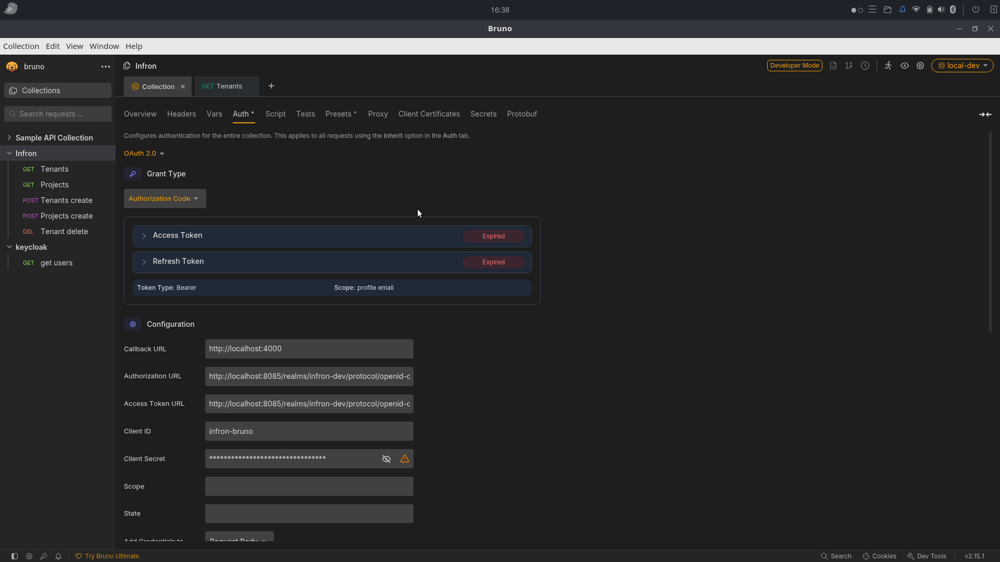

## Development setup (Ubuntu / Linux)

This guide covers:

- Running the **dev infrastructure** (Postgres + Keycloak) via Compose (Docker or Podman)
- Running the JVM services locally:
  - `muxon-initializer`
  - `core-services`
  - `console-proxy`
  - `orchestrator`

---

## Prerequisites

- **Git**
- **JDK**: a recent Temurin/OpenJDK (project is Gradle + Spring Boot)
- **Container runtime**: Docker *or* Podman
- **Node.js** (optional): only if you're running the web UI locally

---

## Clone the repo

```bash
git clone git@github.com:sal/muxon-core.git
cd muxon-core
```

---

## Container runtime

### Option A: Docker

Install Docker and the Compose plugin (varies by distro). Verify:

```bash
docker --version
docker compose version
```

### Option B: Podman

Install Podman + Compose:

```bash
sudo apt update
sudo apt install -y podman podman-compose
```

If you use Podman Desktop and it can’t talk to Podman, enable the user socket:

```bash
systemctl --user enable --now podman.socket
```

If image pulls fail due to “unqualified” names, ensure `/etc/containers/registries.conf` has a `registries.search` entry similar to:

```ini
[registries.search]
unqualified-search-registries = ["docker.io", "registry.access.redhat.com", "registry.fedoraproject.org"]
```

---

## Start the dev stack (Postgres + Keycloak)

The Compose file is `compose/dev-stack.yml`.

The dev realm import (`compose/keycloak/realm-muxon-dev.json`) defines a confidential OIDC client **`muxon-api`** whose secret is the placeholder **`${MUXON_API_CLIENT_SECRET}`**. Keycloak substitutes that from the **`MUXON_API_CLIENT_SECRET`** environment variable on the Keycloak process when the realm is imported.

The base `compose/dev-stack.yml` does not set that variable. If you skip the Compose override in the next subsection, open the admin console after import and copy the **actual** client secret for `muxon-api` into `muxon-oidc-secret` (see step **1) Run `muxon-initializer`** below).

To use a **fixed** secret for local dev (recommended so it matches `muxon-oidc-secret` used by `muxon-initializer`), extend the Keycloak service with `MUXON_API_CLIENT_SECRET`. For example, add a small Compose override (keep the file out of git if it contains real secrets) or merge into `compose/dev-stack.override.yml`:

```yaml
services:
  keycloak:
    environment:
      MUXON_API_CLIENT_SECRET: "your-local-muxon-api-secret"
```

Use the **same string** in `$HOME/.secrets/muxon-oidc-secret` when you run the initializer (see below). If the realm was **already** imported once, changing the env var alone does not rotate the client secret in Keycloak; use the admin console **Regenerate** action or remove Keycloak’s data volume and import again.

### Start (Docker)

From the repo root:

```bash
docker compose -f compose/dev-stack.yml up -d
```

### Start (Podman)

From the repo root:

```bash
podman-compose -f "$PWD/compose/dev-stack.yml" up -d
```

`podman-compose` 1.x changes the process working directory to the compose file’s folder and then re-opens the path you passed to `-f`. A relative path like `compose/dev-stack.yml` therefore breaks (it looks for `compose/compose/...`). Prefix with `"$PWD/"` as above, or pass a fully absolute path.

### Stop / clean up

```bash
# Docker
docker compose -f compose/dev-stack.yml down

# Podman
podman-compose -f "$PWD/compose/dev-stack.yml" down
```

### Endpoints

- **Postgres**: `localhost:5432`
- **Keycloak**: `http://localhost:8085`
- **Keycloak realm**: `muxon-dev` (imported from `compose/keycloak/realm-muxon-dev.json`)

---

## Do I need `compose/dev-stack.override.yml`?

**Usually no.** `compose/dev-stack.yml` already mounts and imports `compose/keycloak/realm-muxon-dev.json`.

Use `compose/dev-stack.override.yml` only if you specifically want what it changes:

- **Keycloak admin password**: override sets `KEYCLOAK_ADMIN_PASSWORD` to `Infr0n@1234` (base file uses `admin`)
- **Realm import volume path**: override uses `${PWD}/compose/...` (sometimes helps on certain Podman setups)

You can add **`MUXON_API_CLIENT_SECRET`** under the same `keycloak.environment` block so the imported `muxon-api` secret is deterministic (see **Start the dev stack** above).

If you do want the override, run Compose with both files (from repo root):

```bash
# Docker
docker compose -f compose/dev-stack.yml -f compose/dev-stack.override.yml up -d

# Podman
podman-compose -f "$PWD/compose/dev-stack.yml" -f "$PWD/compose/dev-stack.override.yml" up -d
```

---

## IntelliJ / local Gradle setup

- Make sure the wrapper is executable:

```bash
chmod +x ./gradlew
```

- Confirm Java is available:

```bash
java -version
./gradlew --version
```

---

## Running the backend services locally

You typically run services against the dev stack:

- Postgres: `localhost:5432` (from `compose/dev-stack.yml`)
- Keycloak: `http://localhost:8085` (realm `muxon-dev`)

### 1) Run `muxon-initializer` (bootstrap)

`muxon-initializer` is `services:muxon-initializer` with main class `com.sal.muxon.bootstrap.BootstrapApplication`.
It requires CLI arguments pointing at an initial config YAML and a few secrets on disk.

Create local secret files (example paths used by the IntelliJ run config). The passphrase and DB password below match the default dev Postgres user password in `compose/dev-stack.yml`.

```bash
mkdir -p "$HOME/.secrets"
printf '%s' 'Infr0n@1234' > "$HOME/.secrets/passphrase"
```

**`muxon-oidc-secret` — OIDC client secret for `muxon-api`**

The file must contain the **Keycloak client secret** for client **`muxon-api`** (see `issuerUri` / `clientId` in `services/muxon-initializer/src/main/resources/initial-config.yaml`). It is not the Keycloak admin password.

1. Start the dev stack and wait until Keycloak is up (`http://localhost:8085`).
2. Open the **Keycloak Admin Console** and sign in (default from `compose/dev-stack.yml`: user **`admin`**, password **`admin`**, unless you use `compose/dev-stack.override.yml`).
3. Select realm **`muxon-dev`** → **Clients** → **`muxon-api`** → **Credentials** (Keycloak 17+ UIs: **Client authentication** on, then open the **Credentials** tab).
4. Copy **Client secret** and write it to the secret file (no trailing newline):

```bash
printf '%s' 'PASTE_CLIENT_SECRET_HERE' > "$HOME/.secrets/muxon-oidc-secret"
```

If you set **`MUXON_API_CLIENT_SECRET`** in Compose before the **first** realm import (see **Start the dev stack** above), use that **exact same value** in `muxon-oidc-secret` instead of copying from the UI. If you **Regenerate** the secret in Keycloak, update this file to match.

Run it (from repo root):

```bash
./scripts/dev-init.sh
```

This will:

- Run Flyway migrations (OSS)
- Insert initial RBAC/bootstrap data
- Generate **per-service** Spring configs:
  - `services/core-services/src/main/resources/application.yaml`
  - `services/orchestrator/src/main/resources/application.yaml`
  - `services/console-proxy/src/main/resources/application.yaml`

### 2) Run `core-services`

Module: `services:core-services`  
Main: `com.sal.muxon.CoreServicesApplication`

```bash
export MUXON_PASSPHRASE='Infr0n@1234'
./gradlew :services:core-services:bootRun
```

### 3) Run `console-proxy`

Module: `services:console-proxy`  
Main: `com.sal.muxon.console.ConsoleProxyApplication`

```bash
./gradlew :services:console-proxy:bootRun
```

### 4) Run `orchestrator`

Module: `services:orchestrator`  
Main: `com.sal.muxon.orch.OrchestratorApp`

```bash
export MUXON_PASSPHRASE='Infr0n@1234'
./gradlew :services:orchestrator:bootRun
```

---

## (Optional) Web UI local setup

Install Node.js and npm (version depends on the web app’s requirements). Example using NodeSource:

```bash
sudo apt remove -y nodejs || true
curl -fsSL https://deb.nodesource.com/setup_24.x | sudo -E bash -
sudo apt install -y nodejs
node -v
npm -v
```

### Keycloak config for web

Keycloak well-known endpoint:

```text
http://127.0.0.1:8085/realms/muxon-dev/.well-known/openid-configuration
```

If the web app complains about missing authority/metadata URL, create `web/.env.local`:

```dotenv
NEXT_PUBLIC_OIDC_AUTHORITY=http://localhost:8085/realms/muxon-dev
NEXT_PUBLIC_OIDC_CLIENT_ID=muxon-web
NEXT_PUBLIC_OIDC_REDIRECT_URI=http://localhost:4000/auth/callback
NEXT_PUBLIC_OIDC_POST_LOGOUT_REDIRECT_URI=http://localhost:4000/
NEXT_PUBLIC_OIDC_SCOPE=openid profile email
NEXT_PUBLIC_API_BASE=http://localhost:8080
```

---

## Troubleshooting

### JWT “Missing required audience …”

If Spring Security rejects tokens due to a missing `aud`, add an **Audience mapper** in Keycloak using a Client Scope:

- **Create a client scope**
  - Realm → Client Scopes → Create client scope
  - Name: `aud-<your-api-client-id>`
  - Protocol: `openid-connect`
- **Add an audience mapper**
  - Client scope → Mappers → Create mapper
  - Mapper type: `Audience`
  - Included Client Audience: your API client id
  - Add to access token: ON
- **Assign the client scope to the UI client**
  - Clients → `<ui-client>` → Client Scopes
  - Add the new scope to Default (or Optional)
  - Log out/in to refresh tokens

### Postgres clients

- **psql**

```bash
sudo apt install -y postgresql-client
psql --host=localhost --port=5432 -U infron
```

- **DBeaver**

```bash
sudo snap install dbeaver-ce
```

### OpenAPI tooling

```bash
npm i @redocly/cli@latest
npx @redocly/cli lint openapi/openapi.yaml
```

### Bruno (API client) notes



Keycloak client config:

- **Valid redirect URLs**: `http://localhost:4000/*`
- **Client authentication**: On (if using a confidential client)

  