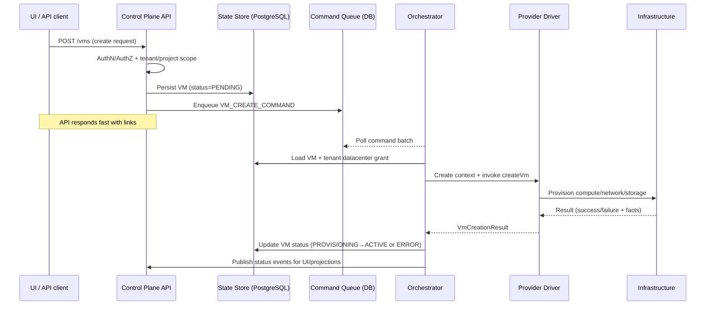

# Concepts Overview

Quick tour of Infron: what it is, who it is for, and the main building blocks.

## What Infron is
- **Infron Core** is the control plane: API, orchestration, state, and provider abstractions.
- **Infron Nexus** overlays enterprise features (additional providers, SSO options, observability) without forking the Core API.
- Built for **multi-tenant** operators who need guardrails for resource isolation and delegated access.

## Planes and runtime layout
```mermaid
flowchart LR
    subgraph Clients
        UI[Infron Web UI]
        APIClients[API Clients]
    end

    subgraph ControlPlane[Control Plane (Core)]
        APIGW[API / AuthZ layer]
        CoreSvc[Core Services
        (REST API, projections)]
        CmdQueue[Command Queue
        (DB-backed)]
        Orchestrator[Orchestrator
        (scheduled workers)]
        EventPub[Event Publisher]
        DB[(PostgreSQL
        state store)]
    end

    subgraph ProviderPlane[Provider / Infra Plane]
        ProviderDrivers[Provider Drivers
        (Libvirt, Proxmox, …)]
        Infra[Compute + Network + Storage]
    end

    Clients --> APIGW --> CoreSvc
    CoreSvc --> DB
    CoreSvc --> CmdQueue
    CmdQueue --> Orchestrator
    Orchestrator --> ProviderDrivers --> Infra
    ProviderDrivers --> EventPub --> CoreSvc
```

### Key components
- **API layer**: Accepts intents (e.g., create VM), enforces AuthN/Z, and persists desired state.
- **State store (PostgreSQL)**: Authoritative store for tenants, projects, providers, grants, VMs, and projections.
- **Command queue (DB-backed)**: Durable handoff between API and orchestrator; commands are async and idempotent.
- **Orchestrator**: Polls commands, enriches context, and drives provider-specific workflows.
- **Provider drivers**: SPIs that implement concrete backends (Libvirt, Proxmox, and extensions in Nexus).
- **Events**: Status/operation events emitted for audit, UI updates, and downstream consumers.
- **Identity**: Delegated to the configured IdP (e.g., Keycloak in the dev stack); claims flow into RBAC checks.

## Multi-tenant model
- **Tenants** own isolated namespaces. Projects (optional) allow finer grouping inside a tenant.
- **Roles & grants**: Access is scoped to tenant/project; datacenter grants control which providers/nodes can be used.
- **Per-tenant provider context**: Credentials and placement logic are derived from the tenant datacenter grant and passed to provider drivers.

## Primary resource types
- **Providers**: Logical connectors to infrastructure backends.
- **Node clusters / datacenters**: Grouping of nodes and storage/network domains made consumable via tenant grants.
- **Workloads (VMs)**: Compute instances described by specs, metadata, and tags.
- **Supporting domains**: Storage pools, networks, and images exposed by providers.

## Workload creation flow (API → control plane → provider)


### Guarantees and behaviors
- **Fast API responses**: Heavy work runs asynchronously; clients poll or subscribe to events.
- **Durable intent**: Desired state and commands are stored before orchestration begins.
- **Provider isolation**: Failures in a driver do not crash the control plane; commands are marked failed with context.
- **Traceability**: Events carry tenant/project, actor, and correlation IDs for audit and replay.
