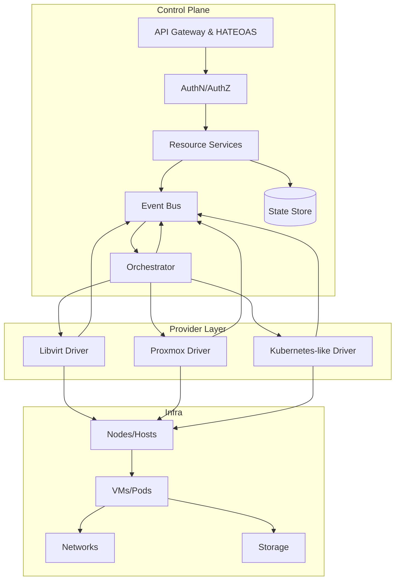
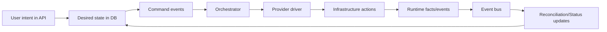
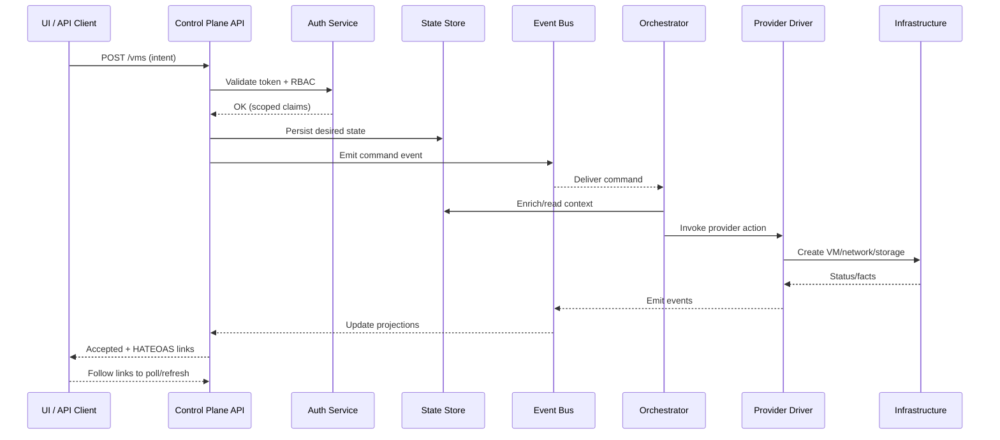

# Platform Architecture

Explain how Infron is assembled and how control flows.

## Control plane services, APIs, and HATEOAS links

The control plane exposes a REST API that is the only entrypoint for UI and automation. Each response provides HATEOAS links so clients can discover the next valid actions without hard-coding URLs or state transitions. Core responsibilities:

- **API Gateway**: Validates payloads, enforces authN/authZ, and shapes HATEOAS responses.
- **Resource Services**: CRUD for tenants, projects, providers, datacenters, node clusters, VM classes, networks, and storage domains.
- **Orchestrator**: Turns user intent into provider-specific actions through events and commands.
- **Event Bus**: Decouples request handling from long-running infrastructure work; everything meaningful emits events for auditability and reconciliation.
- **State Store**: Persists desired state, facts from providers, and audit trails. Control plane state is authoritative; providers are sources of truth for runtime facts.

## Provider abstraction and drivers

Infron isolates provider specifics behind a common contract:

- **Provider Registry**: Selects the right driver based on provider type and tenant/project scope.
- **Drivers**: Translate portable intents into provider APIs. Current drivers include libvirt (KVM), Proxmox, and a Kubernetes-like target for cluster-style scheduling.
- **Pluggability**: Drivers are loaded as modules; adding a provider does not change API routes or resource schemas.
- **Idempotent operations**: Drivers reconcile desired state vs. observed state to recover from partial failures.

## Data/control plane separation and responsibility boundaries

- **Control plane**: Holds desired state, issues commands, and tracks intent. It never performs infrastructure mutations directly.
- **Data/infra plane**: Executes the work (hypervisors, Proxmox nodes, storage, networking). It reports facts/events back.
- **Boundary enforcement**: All mutations flow through the orchestrator via the event bus; direct infra writes from API handlers are forbidden. Providers are the only execution authorities.

## Multi-tenancy isolation (authZ/authN, project scoping)

- **Tenants and projects**: Every resource is namespaced to a tenant and (optionally) a project, preventing cross-tenant data leakage.
- **AuthN/AuthZ**: Centralized identity; role- and attribute-based permissions enforced at the API edge and propagated into orchestrator commands.
- **Scoped providers**: Provider credentials are scoped per tenant/project, preventing accidental reuse across boundaries.
- **Auditability**: Events include tenant/project IDs and actor metadata, enabling forensic tracing.

## High-level request flow (UI/API → control plane → provider)

Example: create VM / workload request.

Key guarantees:

- API responses are fast; heavy work is async via events.
- Every state change emits events for replay and reconciliation.
- Failures are isolated to provider drivers; control plane remains healthy.

## Edition overlays: how Nexus extends Core without forking API paths

- **Core**: Baseline control plane, orchestration, and provider contracts.
- **Nexus overlay**: Adds enterprise features (policy packs, governance, catalog, chargeback) as modules that hook into events and projections, not by forking APIs.
- **Compatibility**: The same API surface and HATEOAS links remain valid; overlays add capabilities via additional links, filters, and projections.
- **Deployment**: Overlays can be enabled per-tenant or installation, minimizing drift between editions.
